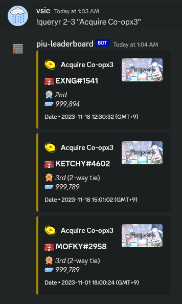

# piu-leaderboard


*piu-leaderboard* is a discord bot which monitors the official leaderboards for [Pump it Up Phoenix](https://phoenix.piugame.com/leaderboard/over_ranking.php). The bot offers various commands for querying different chart leaderboards, as well as the ability to track specific players that the bot will automatically send leaderboard updates for.

## Setup

If you are an admin of a discord server and would like to add this bot to your server, you can do so by clicking this [link](https://discord.com/api/oauth2/authorize?client_id=1190188505947701248&permissions=265216&scope=bot). You will need to have the `Manage Server` permission to do this.

Once the bot is in your server, you should create a new channel titled `piu-leaderboard`. This is where the bot will post leaderboard updates and where users can interact with the bot. If you encounter any problems with the bot, please open an issue in this repo.

## Commands

### Leaderboard Queries
```python
# Query a speicific player's rank on a chart
!queryp <player_id> <chart_id>

# Query a specific rank or range of ranks on a chart
!queryr <chart_id> <rank>
```

### Player tracking
```python
# Begin tracking a player
!track <player_id>

# Stop tracking a player
!untrack <player_id>

# List all players being currently tracked (server-specific)
!tracking
```

### Parameters

The following parameters are used in some of the commands above. All are case-insensitive.

| Parameter | Description |
| --- | :--- |
| `player_id` | The player's ID on the leaderboard in the format of `name[#tag]`, where `#tag` is the 4-digit discriminator. If `#tag` is not specified, the bot will search for all players with the name. |
| `chart_id` | The ID of the chart to query in the format of `"Song title (S/D/Co-op)(Level)"`. This parameter must be enclosed in quotes. For Co-op chart levels, use x2, x3, etc...  |
| `rank` | The rank or range of ranks to query. To query a range, use the format `rank1-rank2`, where `rank1 < rank2`. Queried ranks must be between 1 and 100.  |

## Examples

### Querying a player's rank on a chart

 

### Querying multiple ranks on a chart



### Automatic updates for a tracked player

## License

This project is available under the [MIT license](LICENSE). You can build upon this project however you wish. Feel free to open an issue or pull request if you have any suggestions or improvements, and I will try to respond when I have the time.
